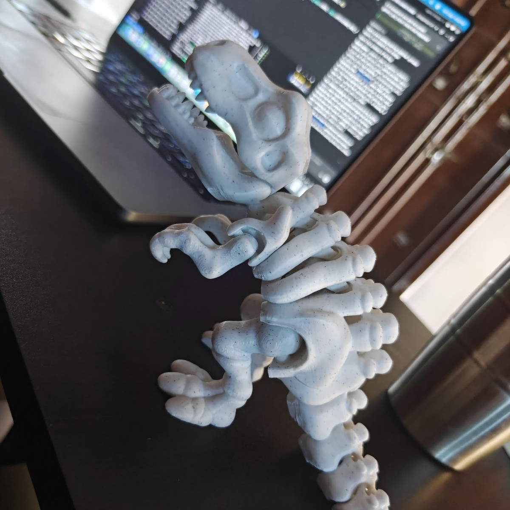
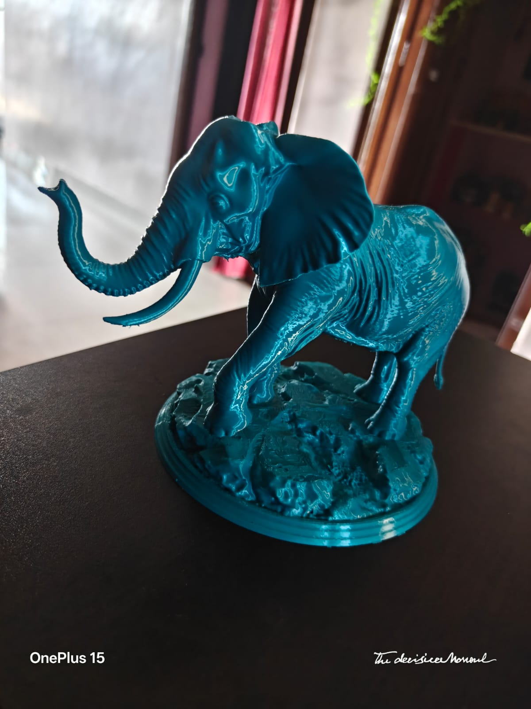

<div align="center">



<br /><br />

# 🖨️ AswinPrints

### Your Ideas, Printed in 3D — Pondicherry, India

[](https://3d-prints.aswincloud.com/)
[](https://workers.cloudflare.com)
[](https://bambulab.com)
[](https://www.instagram.com/3dprinthub.offl)
[](#)

</div>

---

## ✨ About

**AswinPrints** is a custom 3D printing business run by [Aswin Zayasankaran](https://www.aswincloud.com), based in Pondicherry, India. Powered by the **Bambu Lab A1**, I print everything from intricate figurines and decorative pieces to functional prototypes and personalised gifts.

> 🎯 **Goal**: Make 3D printing accessible to everyone — fast turnaround, fair pricing, quality you can see.

---

## 🎨 Sample Prints

<div align="center">

| | | |
|---|---|---|
|  |  |  |
|  |  |  |

*[View full gallery →](https://3d-prints.aswincloud.com/#gallery)*

</div>

---

## 🛠️ Services

| Service | Description |
|---|---|
| 🎨 **Custom Figurines** | Characters, mascots, collectibles printed with fine detail |
| ⚙️ **Functional Parts** | Replacement components, brackets, mechanical parts |
| 🏠 **Home Décor** | Vases, wall art, organizers, decorative accents |
| 🎁 **Personalised Gifts** | Name plates, keychains, one-of-a-kind custom pieces |
| 🔬 **Prototypes** | Rapid prototyping for product ideas and engineering models |
| 📦 **Small Batch Runs** | Multiple copies with consistent quality |

---

## 📐 How It Works

| Step | What Happens |
|---|---|
| **1 · Send Your Request** | Fill in the [quote form](https://3d-prints.aswincloud.com/#quote) with your idea. Attach an `STL`, `OBJ`, or `3MF` file if you have one — otherwise just describe it. |
| **2 · Get a Quote** | I review the model, materials and quantity, then reply with pricing. Usually within a few hours. |
| **3 · Print & Review** | Once approved, your piece goes on the printer. I share photos before it ships. |
| **4 · Deliver** | Pickup in Pondicherry, or shipping anywhere in India. |

---

## ⚙️ Tech Stack

| | Tool |
|---|---|
| **Printer** | Bambu Lab A1 |
| **Materials** | PLA · PETG · TPU — with custom colour matching |
| **File Formats** | STL · OBJ · 3MF |
| **Frontend** | Pure HTML / CSS / JS — no framework, no build step |
| **Backend** | Cloudflare Worker (`src/`) — static assets + `/api/*` |
| **Database** | Cloudflare D1 (SQLite) — products and orders |
| **Payments** | [Razorpay](https://razorpay.com) Standard Checkout |
| **Email** | [Resend](https://resend.com), sent from the Worker |

---

## 🚀 How the Site Works

A single Cloudflare Worker serves the static site and the API. Paths matching a
file in `public/` are served by the assets binding; everything else falls
through to the Worker, so `/api/*` is handled in `src/`.

```
3d_printing/
├── public/                      # Static site (served via [assets])
│   ├── index.html               # Main website — shop, cart, sign-in, account menu
│   ├── shop.html                # Owner dashboard (orders, products, refunds)
│   └── assets/
│       ├── css/style.css        # All styling
│       ├── js/main.js           # Lightbox, animations, quote form, shop + cart
│       └── images/              # 60 sample print photos
├── src/                         # Worker
│   ├── index.js                 # Router: /api/* → api(), else ASSETS.fetch
│   ├── lib.js                   # JSON/HMAC/cookies/escaping/Resend helpers
│   ├── shop.js                  # Catalogue reads + cart pricing (server-side)
│   ├── razorpay.js              # REST client + signature verification
│   ├── orders.js                # Order create/verify/receipt + webhook
│   ├── auth.js                  # Owner sign-in via the auth.aswincloud.com broker
│   ├── customers.js             # Customer sign-in (OTP) + /api/me
│   ├── cart.js                  # Server-side cart + guest merge
│   ├── admin.js                 # Owner-only: product CRUD, orders, refunds
│   └── emails.js                # Email HTML templates
├── migrations/                  # D1 schema (forward-only)
│   ├── 0001_init.sql            # products, orders, order_items, webhook_events
│   └── 0002_seed_products.sql   # 31 products from the gallery
├── test/                        # Offline unit tests (`npm test`)
├── wrangler.toml                # Worker + D1 config; vars only, no secrets
└── .github/workflows/
    └── auto-approve.yml         # Dependabot auto-approval
```

### Local development

```bash
npm install
cp .dev.vars.example .dev.vars    # fill in; gitignored, never committed
npm run db:migrate:local
npm run dev                       # http://localhost:8787
npm test                          # offline unit tests, no network
```

### Quote form pipeline

The form posts JSON to `POST /api/quote`. The Worker validates it server-side,
then sends two emails through Resend:

1. **To me** — the full request, with `reply_to` set to the customer.
2. **To the customer** — an acknowledgement summarising what they submitted.

The customer copy is sent via `ctx.waitUntil()`, so a slow send never delays
the response.

### Asking about something that isn't listed

53 photos are in the gallery but only 31 are products — 18 are unnamed pieces
with no price, and they can't be listed without knowing what they are.

Rather than guess, every gallery photo has **"Request a quote for this"** in its
lightbox, and every product card has **"Different colour or size?"**. Both
scroll to the existing quote form with a visible reference attached (thumbnail,
name, and whether it's a listed item), which travels as `ref_item` and appears
as an "About" row in the owner email. Without that, a request about one of the
18 would arrive with no way to tell which photo it meant.

`ref_item` is customer-controlled text, so it's clipped and escaped like every
other field — never used as a URL or a lookup key.

### Shop and cart

`GET /api/products` returns the visible catalogue from D1 plus the shipping
config; `assets/js/main.js` renders the grid and the cart drawer from it.

The cart in `localStorage` stores **only `{id, qty}`** — no prices, no names.
Everything displayed is re-derived from the API on load, and when checkout
lands the browser will post only those id/qty pairs. `priceCart()` in
`src/shop.js` reads prices from D1 and computes the amount server-side, so a
hand-edited cart can change what you *see* but never what you *pay*.

Money is stored as **integer paise** (`34900` = ₹349), matching Razorpay's API
and avoiding float rounding when summing line items.

### Payments

Razorpay Standard Checkout, called through the REST API with `fetch` and signed
with WebCrypto. The `razorpay` npm SDK is deliberately **not** used: it does
`require("crypto")` and bundles axios's Node HTTP adapter, so it can't build for
a Worker without `nodejs_compat` (`wrangler deploy --dry-run` fails with
`Could not resolve "crypto"`).

```
browser  POST /api/orders  {items:[{product_id,qty}], customer, delivery}
                           ↑ no amount — the server prices it
worker   priceCart() → Razorpay Orders API → insert order (pending)
browser  Razorpay Checkout modal
   ├── success  → POST /api/orders/verify   (shows a receipt; does NOT mark paid)
   ├── dismiss  → order stays pending, nothing charged
   └── failed   → error shown, order stays pending
razorpay POST /api/webhook/razorpay          ← the source of truth
                           marks paid, sends both emails
```

Two things worth knowing before touching this code:

**Two different secrets.** `KEY_SECRET` signs the checkout callback
(`HMAC(order_id|payment_id)`); `WEBHOOK_SECRET` signs webhooks (`HMAC(raw
body)`). `WEBHOOK_SECRET` is a string you choose in the dashboard. Conflating
them is the most common Razorpay bug, so `test/payments.mjs` asserts each is
rejected in the other's place.

**Testing with cards.** Use a **domestic** test card — `5267 3181 8797 5449`
(Mastercard), CVV `123`, any future expiry, OTP `1111` (4+ digits succeeds,
fewer fails). The card most tutorials give, `4111 1111 1111 1111`, is classed as
*international* by Razorpay and fails on a stock test account with
`international_transaction_not_allowed`. The checkout modal also rejects some
obviously-fake mobile numbers (`9876543210` among them); `9000090000` works.

**The webhook, not the browser, marks an order paid.** `/api/orders/verify`
only proves the callback is genuine so the customer sees a receipt. If the
browser could set `paid`, anyone could POST a fabricated callback; if only the
browser could, a closed tab would lose the order. The webhook route is also
dispatched *before* the router's shared `request.json()`, because its HMAC
covers the exact bytes received — re-serialising parsed JSON breaks
verification.

Five products depicting licensed characters are seeded `visible = 0` — they
stay in the portfolio gallery but aren't listed for sale. Prices in
`0002_seed_products.sql` are **placeholders** and are meant to be corrected in
the admin dashboard before live keys are enabled.

> **Note:** the quote form previously ran on GitHub Actions via `repository_dispatch`,
> which required a GitHub PAT injected into `main.js` at deploy time — readable
> by anyone who viewed source. Now the only credential is a Worker secret and
> nothing sensitive reaches the browser.

---

### Customer accounts

Customers sign in **on the main page** — an inline modal, no separate route —
with **Google, GitHub or Microsoft**, or a **6-digit code emailed to them** — no
password to set, forget, or leak. Built on `@aswincloud/auth`'s OTP primitives
(`generateOtp`/`hashOtp`/`otpHashEquals` and the `otp_codes` table), so codes are
stored peppered-and-hashed with an attempt counter, never in plaintext. Its
higher-level `signup()`/`verifyOtp()` flows are deliberately unused: both require
a password.

Signing in changes the account button into a menu: **My orders** (a second tab
in the cart drawer), **Sign out**, and — only when `/api/me` reports `is_admin` —
**Dashboard**. That menu entry is the only route to `/shop`; nothing else links
it. The flag is a display hint, so a client faking it just gets a link that 401s.

`/shop` is the one page that remains separate, because a 31-row product editor
and an order table need the room.

**Two auth schemes, kept apart.** Admin uses `ap_session` with token purpose
`owner_session`; customers use `ap_user` with purpose `customer_session`. The
purpose is bound into the HMAC, so a customer cookie replayed at `/api/admin/*`
fails signature verification rather than a string comparison someone could later
refactor away. `test/customers.mjs` asserts this in both directions.

**Order history is scoped by the session and nothing else.** `myOrders(env, user)`
takes no url or query argument, so there is no parameter by which one customer
could request another's orders — the function has nowhere to put one. Tested
against a seeded second account with `?user_id=`, `?email=`, `?receipt=` and
`?id=` all attempted.

**The server cart still carries no price.** Rows are `(user_id, product_id, qty)`.
`priceCart()` remains the only thing that decides an amount.

**OAuth is treated as equivalent proof to an emailed code.** Google and GitHub
verify the address, so one account per email regardless of which route was used,
and guest orders are claimed either way. Identities link on
`(provider, provider_user_id)` rather than email — the provider's id is stable
and an email is not, so linking on email would orphan a customer from their own
order history the day they change their Google address.

The callback signs everyone in as a customer, and issues an **additional** admin
cookie when the email is on the `OWNER_EMAIL` allowlist. Being a customer never
implies being an admin.

**Guest orders are claimed on first sign-in** — `UPDATE orders SET user_id …
WHERE user_id IS NULL AND lower(cust_email) = ?`. The code proves control of the
mailbox the order was placed with. Worth being plain about: order history is
therefore only as strong as the customer's email, and an order already attached
to another account is never re-claimed.

**Rate limiting.** `POST /api/auth/code` is unauthenticated and sends email, so:
5 sends per address per hour, the package's 5-attempt cap per code, its 60s
resend cooldown, and `{ok:true}` returned for unknown / throttled / failed-send
alike so the endpoint can't be used to discover which addresses have accounts.
There is no per-IP limit yet — Cloudflare's Rate Limiting binding is the right
tool and needs a dashboard change.

### Dashboard

Reachable two ways, both ending at the same `OWNER_EMAIL` allowlist check:

1. **Broker OAuth** (`ap_session`) — preferred, but needs `site=3dprints`
   registered at `provision.aswincloud.com`.
2. **An emailed code** (`ap_user`) — sign in at `/login` with an address on the
   allowlist. This exists because the broker has no registration for this site
   yet, which left the dashboard unreachable and the placeholder prices
   uneditable.

`currentAdmin()` in `src/auth.js` tries the broker session first, then falls back
to a customer session whose verified email passes `ownerAllowed()`. It is a
second *transport*, not a second policy — a customer cannot self-promote, because
the allowlist only changes via a Worker var.

The trade is worth stating: route 2 makes admin access **email-strength**.
Whoever can read the owner's inbox can issue refunds and read customer addresses.
Prefer route 1 once the broker knows this site.

Products can be edited **in bulk**: change any number of prices or visibility
toggles, then "Save all changes" sends one `PATCH /api/admin/products` instead of
one request per row. The write is all-or-nothing — every row is validated before
anything is written, because a partial write would leave you unable to tell which
of 26 prices took. Per-row Save is still there for a single tweak.

`/shop.html` — orders (with status controls and refunds) and products (price and
visibility editing). Sign-in goes through the central broker at
`auth.aswincloud.com`: it authenticates with Google/GitHub/Microsoft and relays
the verified email back, signed with this site's `RELAY_SECRET`. There are no
local user or session tables — the session is a signed token in a cookie, and
the email is re-checked against `OWNER_EMAIL` on **every** request, so removing
an address revokes access immediately rather than whenever the cookie lapses.

Two deliberate restrictions:

- **`OWNER_EMAIL` must be non-empty.** `@aswincloud/auth`'s `isOwner()` treats
  an empty allowlist as "allow any authenticated user" — fine for a public site,
  catastrophic for a page showing customer addresses and payment ids. `auth.js`
  therefore checks the allowlist is non-empty *first* and denies everyone if it
  isn't. `test/admin.mjs` asserts this in five ways.
- **The dashboard cannot mark an order paid.** Only the Razorpay webhook does.
  Similarly, `refunded` is only reachable through the refund action, so the
  status can't claim money moved when it didn't.

Deleting a product that appears in any order **hides** it instead, because
`order_items` snapshots the name and price and order history must survive.

## 📬 Get a Quote

Want something printed? Head to the [quote form](https://3d-prints.aswincloud.com/#quote) on the site, or reach out directly:

- 🌐 [aswincloud.com](https://www.aswincloud.com)
- 📧 aswin@aswincloud.com
- 📸 [@3dprinthub.offl](https://www.instagram.com/3dprinthub.offl)
- 📍 Pondicherry, India

---

## 📄 License

© 2026 Aswin Zayasankaran. All rights reserved.
